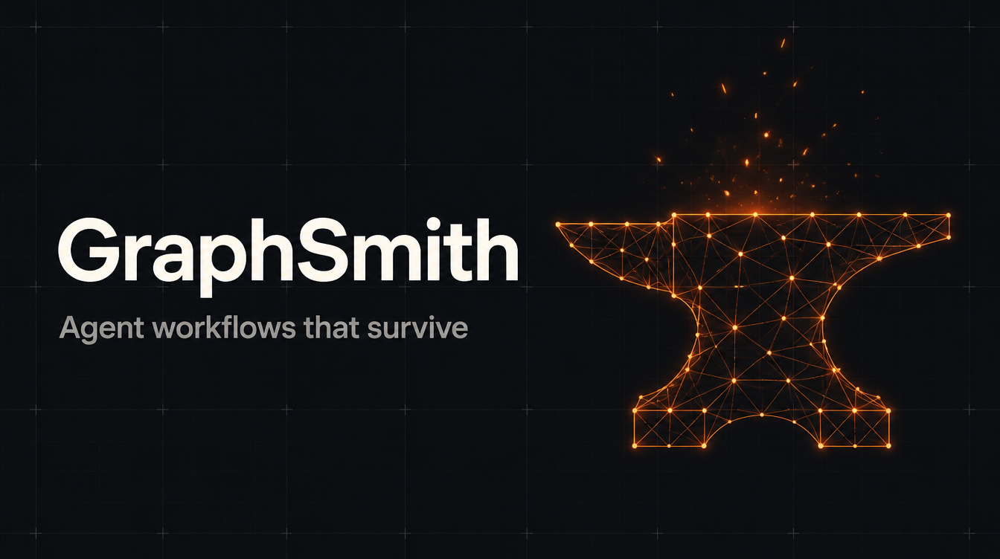

<div align="center">



# ⚒️ GraphSmith

**Describe the job. Approve the plan. Get an AI workflow that's *proven* to survive failure — before you ever trust it.**

[](LICENSE) [](https://www.npmjs.com/package/graphsmith-skill) [](https://agentskills.io) [](https://github.com/SathiaAI/graphsmith/releases)

Works identically in Claude Code, Codex CLI, Gemini CLI, Cursor, Windsurf / Devin Desktop, Hermes, and VS Code Copilot via the [Agent Skills open standard](https://agentskills.io). One install, every agent.

[Get started](#60-second-start) · [What's inside](#whats-in-the-box) · [FAQ](#faq) · [Report a bug](https://github.com/SathiaAI/graphsmith/issues)

</div>

<details>
<summary><b>Table of contents</b></summary>

- [The problem](#the-problem)
- [The solution](#the-solution)
- [The outcome](#the-outcome)
- [60-second start](#60-second-start)
- [What's in the box](#whats-in-the-box)
- [Detailed guide](#detailed-guide)
- [Warnings & disclaimers](#warnings-disclaimers)
- [What this skill does NOT do](#what-this-skill-does-not-do)
- [Roadmap](#roadmap)
- [FAQ](#faq)

</details>

---

## The problem

AI makes it easy to build multi-step automations — and easy to build them wrong in the same three ways, every time:

**1. Amnesia.** The workflow crashes at step 7 of 10 and restarts from step 1 — redoing paid API calls, re-scraping, re-generating. [73% of enterprise AI agent deployments hit reliability failures in their first year](https://agentmarketcap.ai/blog/2026/04/10/durable-agent-execution-production-temporal-modal-event-sourced), and the math is unforgiving: a workflow that's 85% reliable per step fails 4 out of 5 times across 10 steps (0.85¹⁰ ≈ 20% survival).

**2. Duplication.** A retry after a half-finished step sends the same email twice, charges the same card twice, posts the same message twice. Audits of AI-generated automation code find the same four omissions over and over: error handling, safe re-runs, retries, and logging ([Sonar, *State of Code* survey, Jan 2026](https://earezki.com/ai-news/2026-04-26-vibe-coding-just-failed-its-first-real-audit/)).

**3. Hallucination.** Ask the AI about your own codebase and it confidently invents functions, files, and APIs that don't exist — then builds on top of them.

None of these show up in the demo. All of them show up in week two — and the cost is measurable: [63% of developers have spent more time debugging AI-generated code than writing it themselves](https://www.hostinger.com/blog/vibe-coding-statistics/) (JetBrains, 2026), [43% of AI-generated changes needed post-deployment debugging](https://www.javacodegeeks.com/2026/06/vibe-coding-goes-wrong-what-ai-generated-code-actually-breaks-in-production.html), and the documented incident list already includes [an AI agent wiping a production database during an explicit code freeze](https://getautonoma.com/blog/vibe-coding-failures).

And the people hitting these failures are increasingly not engineers — [4 out of 5 people building with AI tools have no technical background](https://subhrajyotimahato.com/blog/vibe-coding-statistics/) (Lovable, *Build Economy* report), while [37% of US developers are actively vibe coding](https://www.hostinger.com/blog/vibe-coding-statistics/) (Stack Overflow, 2025). Founders, PMs, and operators are building real automations with no way to know these failure modes exist until they're living them.

## The solution

GraphSmith is a skill your AI agent follows — it injects the engineering discipline at the moment code is generated, so you don't have to know it:

- **A blueprint before any code.** One screen in plain English: the workers (one job each), what they hand each other, where progress is saved, and exactly when everything stops. Nothing is built until you approve it.
- **Architecture generated correctly by default.** A plain, predictable manager controls the flow; AI works only inside individual steps. Every step saves its progress, is safe to re-run, retries a capped number of times, and writes one log line.
- **Grounded in your actual code.** Via [KnoSky](https://knosky.com) (local-first, auto-updated, your code never leaves your machine), every claim the AI makes about your existing codebase carries a citation to the real file — or is flagged as a guess.
- **Proof, not promises.** A chaos harness kills your workflow mid-run, restarts it, and *asserts* it resumed without redoing finished work. Verification is executable, not "the AI says it's fine."

Already have a broken automation? The linter diagnoses it — mapping "it keeps forgetting / duplicating / looping" to the specific violation, with file and line.

## The outcome

| Without this skill | With it |
|---|---|
| Crash → restart from zero, paying for every step again | Resumes at the exact step it stopped — **proven by the kill test** |
| Retry → duplicate emails, charges, posts | Side effects execute exactly once — **proven by the double-run test** |
| AI invents APIs and files in your codebase | Every claim cited to a real file, or flagged as inference |
| Loops that run (and bill) forever | Hard stop rules and capped retries, agreed in the blueprint |
| Debugging = reading the AI's mind | One structured log line per step: what ran, what happened, how long |
| Architecture decided by vibes, discovered in production | You approve a one-screen blueprint before a line is written |

**Net effect:** the reliability engineering that separates a demo from a production workflow, applied automatically, verified mechanically, at zero added cost.

**For product and engineering leaders evaluating this:** time-to-first-value is under a minute (the scaffold runs with no API keys); the risk profile is deliberately conservative (zero dependencies, read-only grounding, nothing leaves the machine); and there's no lock-in — `references/graduation.md` defines exactly when a workload outgrows this and should move to SQLite, a framework checkpointer, or a durable execution engine, with the migration seam already isolated in the generated code. It's the on-ramp to serious orchestration, not a competitor to it.

---

## 60-second start

```bash
git clone https://github.com/SathiaAI/graphsmith
node graphsmith/scripts/install.js
```

Or via the [skills CLI](https://skills.sh) (installs into whichever agents it detects):

```bash
npx skills add SathiaAI/graphsmith
```

The installer detects every AI coding agent on your machine and installs into each. Then open your agent and say:

> *"Build me an agent that researches new leads and drafts outreach emails."*

The skill takes over: blueprint → your approval → working project → chaos-tested handover. (Devin CLI: invoke with `/graphsmith`.) On Claude.ai, just open the `.skill` file and click **Save skill**.

---

## What's in the box

| Piece | What it does |
|---|---|
| `SKILL.md` | The instructions your AI follows — blueprint gate, build rules, verification |
| `scripts/install.js` | One command installs the skill into every agent on your machine |
| `scripts/scaffold.js` | Generates a runnable, zero-dependency project: manager, workers, save points, resume, retries, logs |
| `scripts/chaos.js` | Kills the workflow mid-run, restarts it, and asserts recovery + no duplicate side effects |
| `scripts/graphlint.js` | Scans existing agent code (JS/TS/Python) for the classic failure patterns, ranked by severity |
| `scripts/knosky-sync.js` | Keeps KnoSky current automatically (offline-safe, never blocks your task) |
| `references/graduation.md` | When to upgrade persistence/orchestration tiers — and when not to |
| `references/multi-agent-coordination.md` | The rules that let multiple agents build in parallel without colliding — lanes, task claims, frozen contracts, review independence, risk-tiered human gates |
| `references/full-build-system.md` | *(Optional, for teams)* The complete 11-Document Build System the coordination rules were distilled from — full agent-first delivery pipeline from PRD to evals |

## Detailed guide

### Path A — "I want to build something new"
1. Say what you want in plain English; the skill activates on its own.
2. Approve the one-screen blueprint (workers, handoffs, save points, stop rules).
3. It generates the project. Run it: `cd your-project && node manager.js`
4. Replace the stub workers in `workers/` with your real logic — AI/API calls live here, and each stub's comments say exactly what to preserve and why.
5. Prove it: `node scripts/chaos.js your-project` — green means crash recovery and exactly-once side effects are verified.

### Path B — "My automation keeps breaking"
Tell your agent the symptom (*forgets where it left off / sent it three times / loops forever*). The skill runs the linter, maps each finding to the broken rule with file and line, and proposes the smallest fix — it will not rewrite what works. With a repo present, KnoSky grounds every diagnostic claim in your actual files.

### Path C — "I'm an engineer; skip the hand-holding"
Talk shop and the skill matches you: terse output, full vocabulary, diffs over explanations, graduation-ladder placement for your workload, and the chaos harness as a CI-able gate. The scripts are dependency-free Node — read them in five minutes, vendor them freely.


### Path D — "I'm running several agents at once"

The moment two or more agents (or sessions) build against the same repo, individual reliability stops being enough — agents overwrite each other's files, redo each other's work, and rubber-stamp their own output. The skill applies a coordination layer distilled from production multi-agent delivery systems:

- **Lanes** — each agent owns a module boundary; one writer per lane, ever. Merge conflicts get treated as planning failures to fix in the plan, not battles to win in the diff.
- **Claims with leases** — work lives in a shared task file; an agent locks a task by claiming it atomically, and a dead agent's expired lease frees the task automatically. No task is ever worked twice or orphaned silently.
- **Frozen contracts** — the interfaces between lanes freeze before dependent work starts, which makes whole waves of tasks parallel-safe *by construction* instead of by luck.
- **No self-certification** — the agent that built something never reviews or merges it, and the checker ideally runs on a different model family, because a fresh context of the same model has the same blind spots.
- **Risk-tiered autonomy** — routine changes flow automatically; anything irreversible or touching money, identity, or private data halts at a human gate with evidence attached. When the tier is ambiguous, it promotes — always.
- **Cite or verify** — "should work" is not a status. Every claim an agent makes carries a resolvable reference or run evidence, with KnoSky as the lookup-before-inventing layer.

**What you get:** parallel speed without parallel chaos — no duplicated work, no clobbered files, no agent approving its own mistakes, and a clear record of what shipped, why, and on whose authority. It scales down honestly, too: a solo builder running two sessions needs only three of the six rules and a plain tasks file.

> **Minimum by default, full system if you want it.** The skill ships with the distilled essentials — the seven build rules and six coordination rules cover most projects. For teams running many agents against production software (real users, money, or regulated data), the repo also includes the complete **11-Document Build System** (`references/full-build-system.md`): document registry and manifest, PRD-to-task traceability, adversarial QA charter, release and rollback runbooks, agent operating protocol with risk-tiered human gates, and eval scorecards for the agents themselves. It's a great-to-have, not a prerequisite — adopt it when your project earns it, not before.

### KnoSky (the grounding layer)
[KnoSky](https://knosky.com) turns your repo into a local map plus a read-only connector your AI cites from. It indexes pointers (titles, headings, short excerpts), never file bodies; nothing is uploaded anywhere. The skill keeps it updated each session and requires citations for any claim about existing code. Free — try it standalone with `npx knosky .`

---

## Warnings & disclaimers

Read these before trusting the output with anything that matters:

- **Templates and guardrails are starting points, not substitutes** for product discovery, security review, legal advice, or experienced engineering judgment. Increase depth — and keep human gates wide — for anything handling money, health, identity, personal data, or regulated activity.
- **The linter is heuristic.** It flags patterns, including occasional false positives; absence of findings is not proof of correctness. The chaos harness provides proof only for the two properties it tests (crash recovery, duplicate side effects) on projects following its conventions.
- **Human gates are load-bearing.** The skill defaults to halting for approval on irreversible or sensitive changes. Removing those gates is your decision and your risk — autonomy should be earned by track record, never assumed, and should narrow again when quality slips.
- **Verification by the author is not verification.** If you scale to multiple agents, keep the no-self-certification rule intact; an agent reviewing its own work is the single most common way bad changes reach production.
- **Never put real production data in test environments,** and never paste live secrets into documents, prompts, or indexes — agents read secrets from the environment, never from files they can echo back.
- **AI-generated tests skew toward the happy path.** Treat green tests written by the same agent that wrote the code as a floor, not a ceiling.

## What this skill does NOT do

Equally important to state explicitly:

- **It does not replace orchestration frameworks or durable execution engines.** LangGraph, Temporal, Inngest and peers solve distributed, long-running, exactly-once workloads at scale. GraphSmith is the disciplined on-ramp; the graduation ladder tells you when to move up, and the checkpoint seam in generated code is built for that migration.
- **It does not run or host anything.** No cloud service, no runtime, no daemon. Everything is local files and local scripts you can read in minutes.
- **It does not write your business logic.** The scaffold gives you the reliable skeleton; the workers' actual jobs — your API calls, your model calls, your rules — are yours to fill in.
- **It does not prove your logic is correct.** The chaos harness proves exactly two properties: crash recovery and no duplicated side effects. A workflow can pass both and still compute the wrong answer — that's what your acceptance criteria and tests are for.
- **It is not a security scanner or supply-chain audit.** The linter finds architecture violations, not vulnerabilities. Use dedicated security tooling for that; the full build system (`references/full-build-system.md`) shows where such gates belong.
- **It does not manage secrets or credentials.** Agents read secrets from the environment — never from files, prompts, or indexes — and this skill never asks for them.
- **It does not phone home.** No telemetry, no analytics, no data leaves your machine from the skill's scripts. KnoSky is local-first by the same principle.
- **It does not remove humans from consequential decisions.** Irreversible changes and anything touching money, identity, or private data are designed to stop at a human gate. That is a feature; the skill will not help you delete it quietly.
- **It does not answer deep questions about your code by itself.** KnoSky routes agents to the right files with citations; the agent still reads the live source. A map, not an oracle.

## Roadmap

Driven by real user questions — the best way to influence it is to [open an issue](https://github.com/SathiaAI/graphsmith/issues).

**In design — v0.2.0: Regulated industries extension** ([#1](https://github.com/SathiaAI/graphsmith/issues/1))
A compliance register template (obligations, data classification, content rules, jurisdictions) that lives in *your* repo while GraphSmith stays one public skill. When the skill detects `docs/compliance/register.yaml`, regulated mode activates: risk-tier gates key off your classifications, evidence packets cite your obligation IDs, and claims about your policies require citations. Includes hardening from adversarial review (default-deny classification, stale-register guards, log hygiene) and new compliance probes for the chaos harness. Design will pass cross-model adversarial review before it ships — the same rule the skill enforces on your workflows.

**In design — System Blueprint & Architecture Review Gate** ([#2](https://github.com/SathiaAI/graphsmith/issues/2))
Information architecture for multi-piece systems: a system blueprint (piece inventory, single-owner data map, frozen contract cards, blast-radius statements), lightweight decision records, a blocking architecture review gate with a concrete rubric and mandatory triggers, and chaos testing extended to the seams between pieces — kill one piece mid-handoff, prove the others' state survives.

**In review — everything above, plus the shipped skill itself**
Both designs and the live v0.1.0 code are going through a three-pass cross-model adversarial review — external model families attacking the shipped scripts (by executing them, not just reading them) and both designs, with findings, dissents, and verdicts dispositioned publicly on the issues. Zero-finding reviews are treated as invalid. Same medicine the skill prescribes.

## FAQ

**Do I need to know how to code?**
No. Describe the outcome, approve the blueprint. You'll eventually edit worker files, but each is small, single-purpose, and commented in plain English.

**Do I need API keys to try it?**
No. The scaffolded project runs immediately with stub workers; you wire in your model of choice when you replace them.

**Which AI agents does this work with?**
Anything implementing the Agent Skills standard: Claude Code, Codex CLI, Gemini CLI, Cursor, Windsurf / Devin Desktop, Hermes, VS Code Copilot, and 25+ others. The scripts are plain Node 18+ and run identically everywhere, including Windows.

**Does my code get uploaded anywhere?**
No. Scripts run locally; KnoSky is local-first by design and indexes pointers on your machine only.

**How is this different from LangGraph / CrewAI / AutoGen?**
Those are frameworks you learn. This is the discipline, enforced at generation time, with a zero-dependency starting point — and an explicit graduation path *to* those frameworks when your workload earns it. On-ramp, not competitor.

**What if the chaos test fails?**
That's the tool working: the message names the broken rule and the fix pattern. It caught a real bug in our own scaffold during development — a step killed after its side effect but before its save point re-executed on resume. The fix (guard every side effect with a check-before-write) is now modeled in every worker stub.

**Why did it refuse my one-giant-agent design?**
Because that's the most documented failure pattern in the space. It proposes the split version and explains the tradeoff; you can overrule it, but it won't hide the risk.

**Can multiple agents work on the same project at once?**
Yes — that's Path D. The skill applies lanes, atomic task claims with leases, and frozen interface contracts so parallel agents never edit the same files or build against moving targets. See `references/multi-agent-coordination.md`.

**Is there a full methodology for production teams?**
Yes — `references/full-build-system.md` contains the complete 11-Document Build System: registry, PRD, technical design, task graph, adversarial QA, release operations, agent operating protocol, and evals. It's included as an optional deep resource; the skill's defaults are the distilled minimum most projects need.

**How do updates work?**
Re-run the installer with `--force` after pulling. KnoSky self-updates each session via `knosky-sync.js`, degrading gracefully offline.

**Is it free?**
Yes. The skill is open source; KnoSky is free under FSL.

**Something's broken — where do I report it?**
Open an issue with your agent name/version, OS, and the failing script's output. The scripts are deliberately tiny; most fixes are one-liners.

---

Born from building [Sathia](https://sathia.ai) - where "just say it" becomes action.
